# QuickMCP - Modern MCP Server Generator

QuickMCP is a powerful web application that allows you to quickly generate Model Context Protocol (MCP) servers from your data sources. Transform your CSV files, Excel spreadsheets, or database tables into fully functional MCP servers that can be integrated with Claude Desktop and other AI tools.

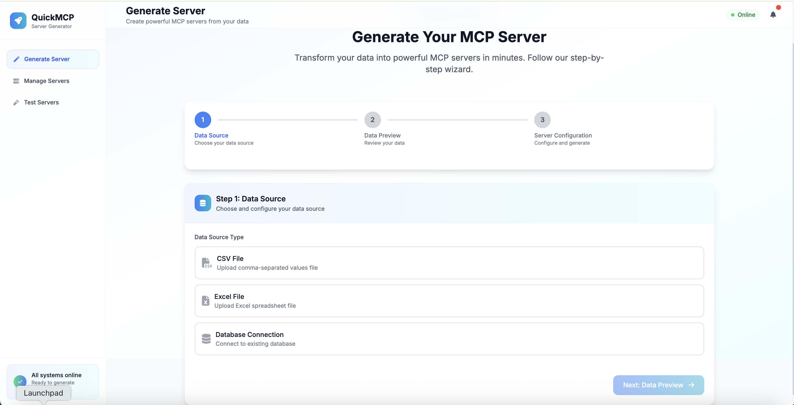

## 🚀 Features

- **Multiple Data Sources**: Support for CSV files, Excel spreadsheets, and database connections
- **Automatic MCP Server Generation**: Generate complete MCP servers with CRUD operations
- **Tool Customization**: Choose which tools to generate for each table (GET, CREATE, UPDATE, DELETE, COUNT, MIN, MAX, SUM, AVG)
- **Real-time Preview**: See your data structure before generating servers
- **Server Management**: View, test, and manage all your generated servers
- **Claude Desktop Integration**: Seamless integration with Claude Desktop via stdio protocol
- **Modern Web Interface**: Clean, responsive UI built with Tailwind CSS

## 📋 Table of Contents

1. [Installation](#installation)
2. [Quick Start](#quick-start)
3. [Docker Setup](#docker-setup)
4. [Application Screens](#application-screens)
5. [Claude Desktop Integration](#claude-desktop-integration)
6. [Usage Examples](#usage-examples)
7. [API Reference](#api-reference)
8. [Development](#development)

## 🛠 Installation

### Prerequisites

- Node.js 18+ 
- npm or yarn
- Docker (optional, for database setup)

### Local Installation

```bash
# Clone the repository
git clone <repository-url>
cd quickmcp

# Install dependencies
npm install

# Build the project
npm run build

# Start the application
npm start
```

The application will be available at `http://localhost:3000`

## 🚀 Quick Start

1. **Start the application**
   ```bash
   npm start dev
   ```

2. **Upload your data**
   - Navigate to the main page
   - Choose between CSV/Excel file upload or database connection
   - Upload your file or configure database connection

3. **Configure your server**
   - Preview your data structure
   - Select tables to include
   - Choose which tools to generate for each table

4. **Generate and use**
   - Click "Generate Server" 
   - Configure Claude Desktop integration
   - Start using your MCP tools!

## 🐳 Docker Setup

QuickMCP includes a Docker setup for easy database integration:

### Start MSSQL Database

```bash
cd quickmcp-docker
docker-compose up -d
```

### Database Connection Details

- **Server:** localhost,1435
- **Username:** sa  
- **Password:** OrderApp123!
- **Database:** OrderTransmissionDB

### Stop Docker Services

```bash
docker-compose down
```

## 📱 Application Screens

### 1. Generate Server - Main Interface


The main interface where you start creating your MCP servers. Choose between file upload or database connection.

### 2. Database Connection Setup

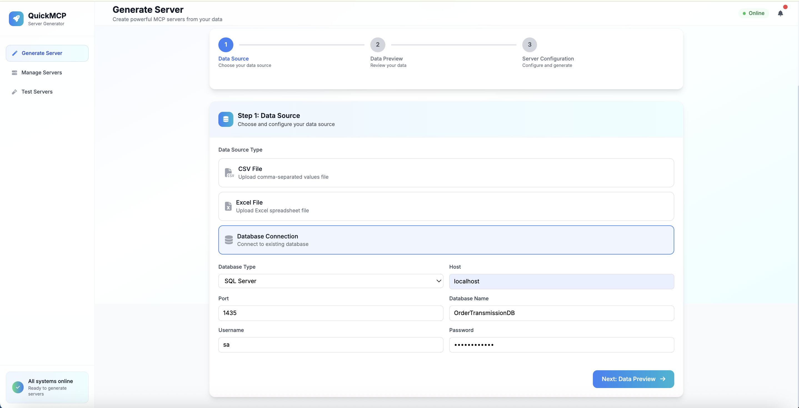

Configure database connections for MySQL, PostgreSQL, SQLite, or MSSQL databases.

### 3. Data Preview & Configuration

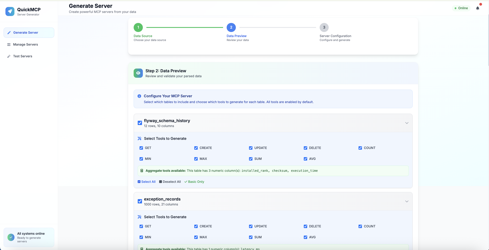

Preview your data structure and select which tables to include in your MCP server.

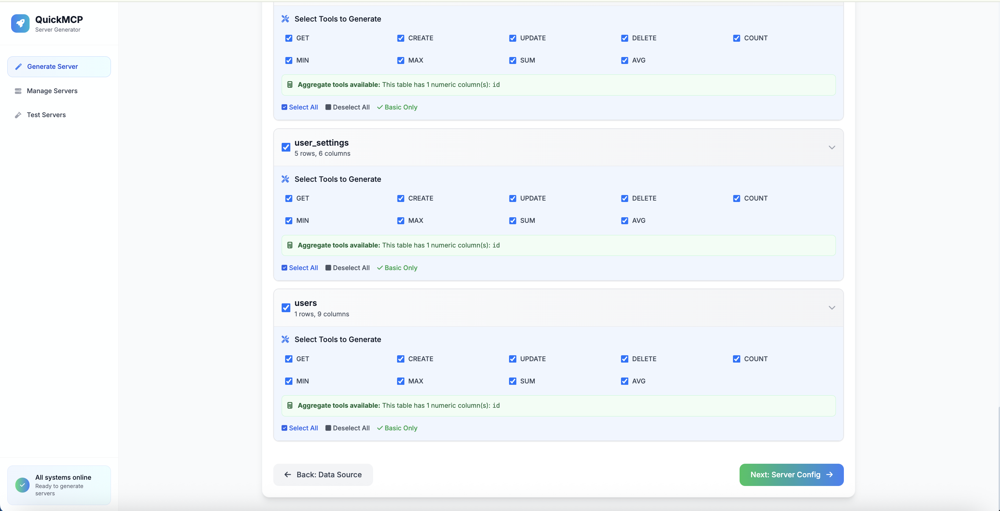

Detailed view of table structure with column types and sample data.

### 4. Server Configuration

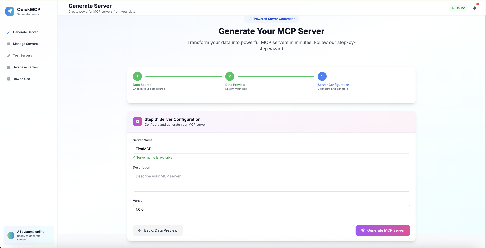

Configure server details like name, description, and select specific tools for each table.

### 5. Generation Success

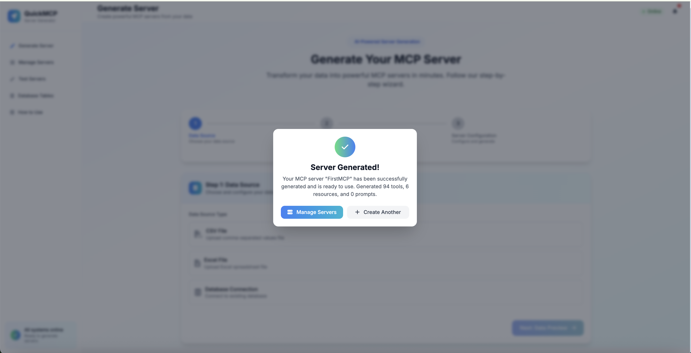

Confirmation modal showing successful server generation with statistics.

### 6. Server Management

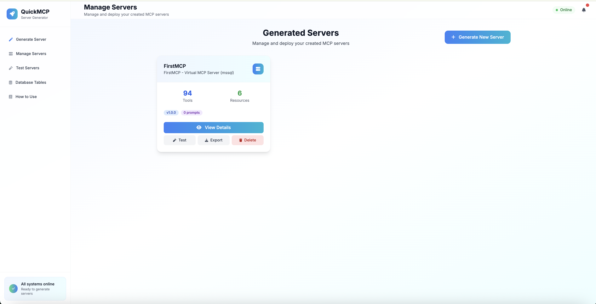

Manage all your generated servers - view details, test, export, or delete.

### 7. Server Details

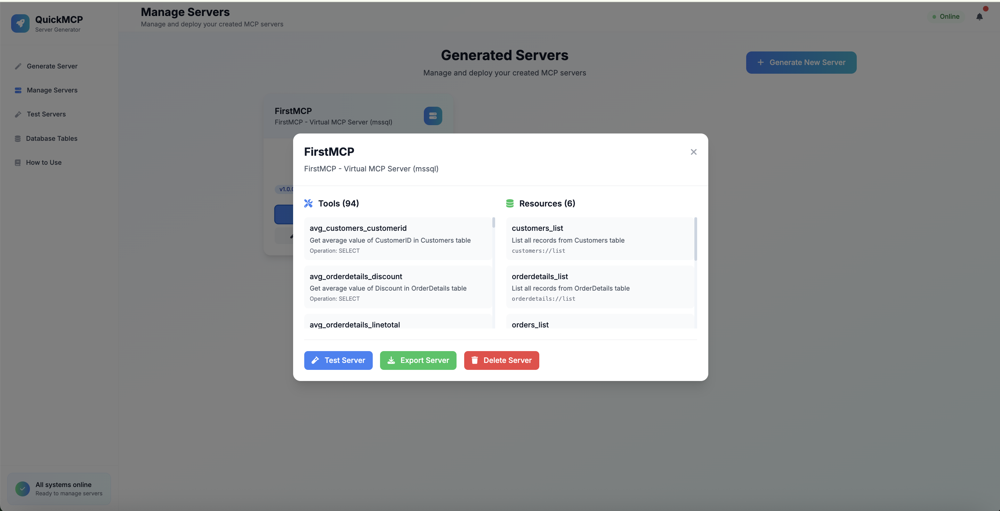

Detailed view of generated server including all tools and resources.

## 🔗 Claude Desktop Integration

QuickMCP provides seamless integration with Claude Desktop through the stdio protocol.

### Configuration Steps

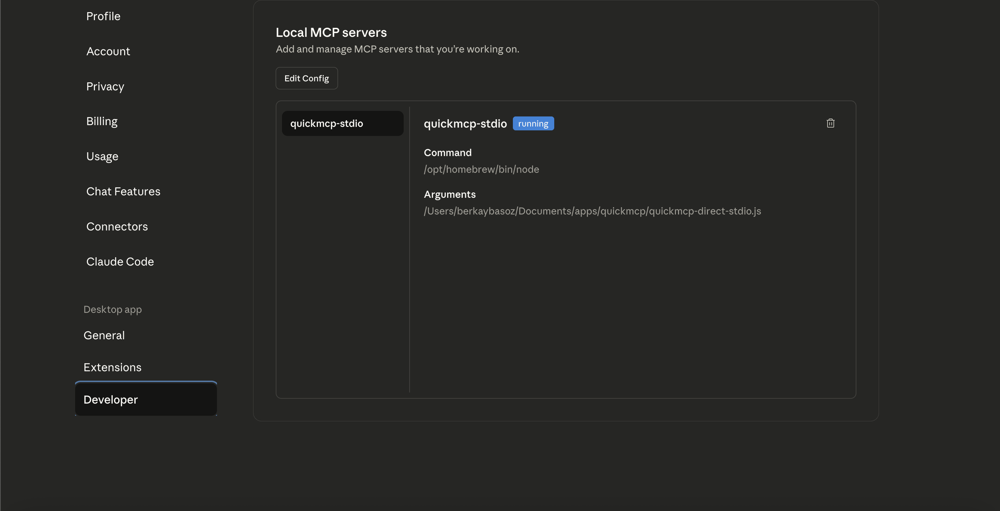

1. **Open Claude Desktop Developer Settings**

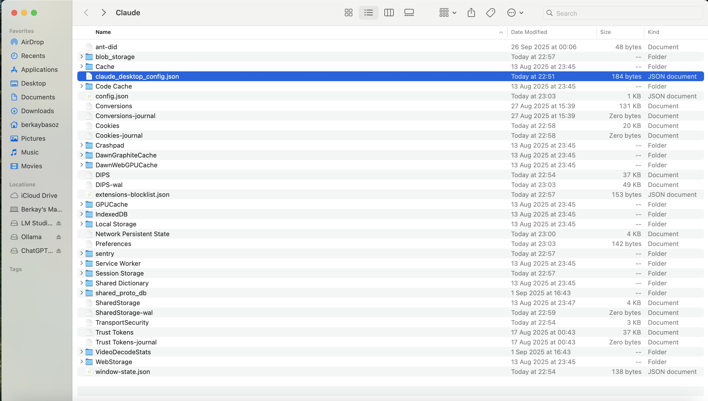

2. **Access Configuration File**

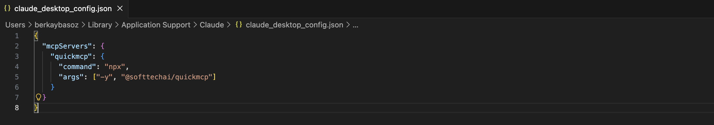

3. **Add QuickMCP Configuration**

Add this to your Claude Desktop config:

```json
{
  "mcpServers": {
    "quickmcp-stdio": {
      "command": "/opt/homebrew/bin/node",
      "args": ["/path/to/quickmcp/quickmcp-direct-stdio.js"]
    }
  }
}
```

### Verification

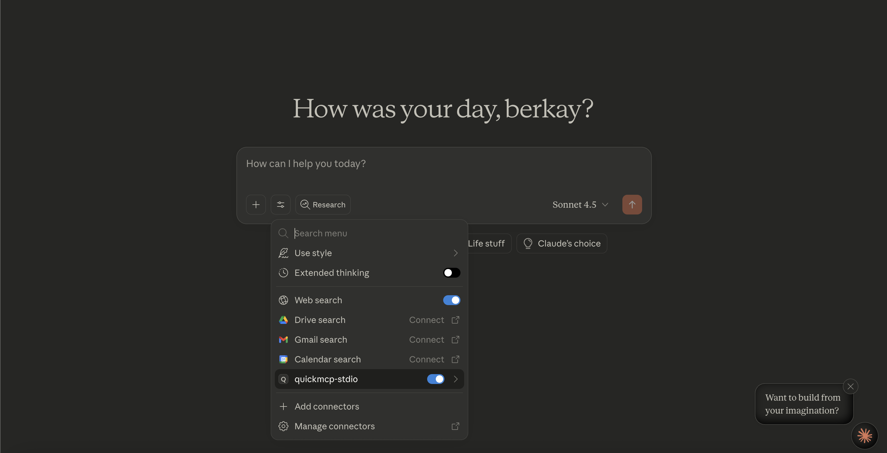

After configuration, QuickMCP will appear in Claude Desktop.

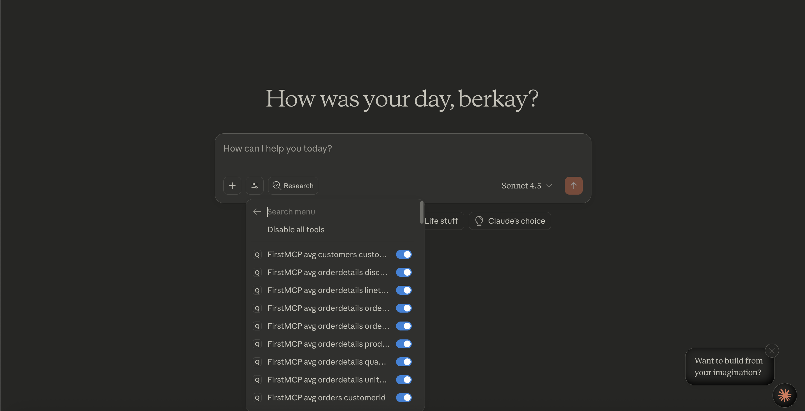

All your generated tools will be available in Claude Desktop with the naming pattern: `serverName__toolName`.

## 💡 Usage Examples

### Example 1: CSV File Processing

1. Upload a CSV file with customer data
2. Preview the data structure
3. Select tools: GET, CREATE, UPDATE for customer management
4. Generate the server
5. Use in Claude Desktop: `customers__get_customers` to retrieve data

### Example 2: Database Integration

1. Connect to your MySQL database
2. Select specific tables (orders, products, customers)
3. Enable all CRUD operations plus aggregation tools
4. Generate comprehensive MCP server
5. Use complex queries through Claude Desktop

### Example 3: Excel Analytics

1. Upload Excel file with sales data
2. Enable aggregation tools (SUM, AVG, MIN, MAX)
3. Generate analytics-focused MCP server
4. Perform data analysis through Claude Desktop

## 🔧 API Reference

### Main Endpoints

- `POST /api/parse` - Parse data source (file or database)
- `POST /api/generate` - Generate MCP server
- `GET /api/servers` - List all generated servers
- `GET /api/servers/:id` - Get server details
- `DELETE /api/servers/:id` - Delete server
- `POST /api/servers/:id/test` - Test server functionality

### Data Source Types

- **CSV**: `.csv` files up to 10MB
- **Excel**: `.xlsx`, `.xls` files up to 10MB  
- **Database**: MySQL, PostgreSQL, SQLite, MSSQL

### Generated Tools

Each table can generate the following tools:

- **GET**: Retrieve records with filtering and pagination
- **CREATE**: Insert new records
- **UPDATE**: Modify existing records  
- **DELETE**: Remove records
- **COUNT**: Count total records
- **MIN/MAX/SUM/AVG**: Aggregation functions for numeric columns

## 🏗 Development

### Project Structure

```
quickmcp/
├── src/
│   ├── web/           # Web application
│   ├── generators/    # MCP server generators
│   ├── parsers/       # Data source parsers
│   ├── database/      # Database management
│   └── types/         # TypeScript definitions
├── dist/              # Compiled JavaScript
├── data/              # SQLite database
├── readme/images/     # Documentation images
└── quickmcp-docker/   # Docker setup
```

### Development Commands

```bash
# Development mode with hot reload
npm run dev

# Build for production
npm run build

# Run tests
npm test

# Type checking
npm run typecheck
```

### Environment Variables

- `PORT` - Web server port (default: 3000)
- `MCP_PORT` - MCP server port (default: 3001)
- `NODE_ENV` - Environment (development/production)

## 🤝 Contributing

1. Fork the repository
2. Create your feature branch (`git checkout -b feature/amazing-feature`)
3. Commit your changes (`git commit -m 'Add some amazing feature'`)
4. Push to the branch (`git push origin feature/amazing-feature`)
5. Open a Pull Request

## 📄 License

This project is licensed under the MIT License - see the LICENSE file for details.

## 🔧 Troubleshooting

### Common Issues

**Tools not showing in Claude Desktop:**
- Ensure QuickMCP is running (`npm start`)
- Verify Claude Desktop configuration
- Check that the stdio script path is correct
- Restart Claude Desktop after configuration changes

**Database connection issues:**
- Verify database credentials
- Check if database server is running
- Ensure network connectivity
- Validate database permissions

**File upload problems:**
- Check file size (max 10MB)
- Verify file format (CSV, Excel)
- Ensure proper file encoding (UTF-8)

## 📞 Support

For issues and questions:
- Create an issue in the repository
- Check existing documentation
- Review troubleshooting section

---

Built with ❤️ using Node.js, TypeScript, and modern web technologies.