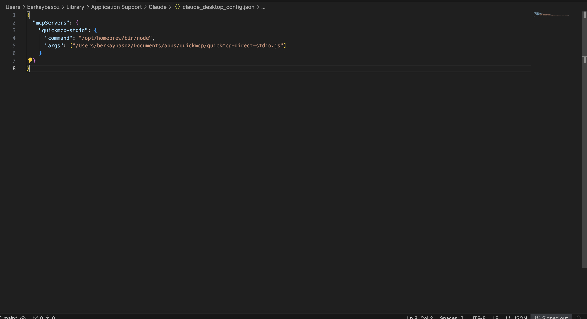

# QuickMCP - Modern MCP Server Generator

QuickMCP is a powerful web application that allows you to quickly generate Model Context Protocol (MCP) servers from your data sources. Transform your CSV files, Excel spreadsheets, or database tables into fully functional MCP servers that can be integrated with Claude Desktop and other AI tools.


## 🚀 Features

- **Multiple Data Sources**: Support for CSV files, Excel spreadsheets, and database connections
- **Automatic MCP Server Generation**: Generate complete MCP servers with CRUD operations
- **Tool Customization**: Choose which tools to generate for each table (GET, CREATE, UPDATE, DELETE, COUNT, MIN, MAX, SUM, AVG)
- **Real-time Preview**: See your data structure before generating servers
- **Server Management**: View, test, and manage all your generated servers
- **Claude Desktop Integration**: Seamless integration with Claude Desktop via stdio protocol
- **Modern Web Interface**: Clean, responsive UI built with Tailwind CSS

## 📋 Table of Contents

1. [Installation](#installation)
2. [Quick Start](#quick-start)
3. [Docker Setup](#docker-setup)
4. [Application Screens](#application-screens)
5. [Claude Desktop Integration](#claude-desktop-integration)
6. [Usage Examples](#usage-examples)
7. [API Reference](#api-reference)
8. [Development](#development)

## 🛠 Installation

### Prerequisites

- Node.js 18+ 
- npm or yarn
- Docker (optional, for database setup)

### Local Installation

```bash
# Clone the repository
git clone <repository-url>
cd quickmcp

# Install dependencies
npm install

# Build the project
npm run build

# Start the application
npm start
```

The application will be available at `http://localhost:3000`

## 🚀 Quick Start

1. **Start the application**
   ```bash
   npm start dev
   ```

2. **Upload your data**
   - Navigate to the main page
   - Choose between CSV/Excel file upload or database connection
   - Upload your file or configure database connection

3. **Configure your server**
   - Preview your data structure
   - Select tables to include
   - Choose which tools to generate for each table

4. **Generate and use**
   - Click "Generate Server" 
   - Configure Claude Desktop integration
   - Start using your MCP tools!

## 🐳 Docker Setup

QuickMCP includes a comprehensive Docker setup with a pre-configured MSSQL database containing sample business data for testing and demonstration purposes.

### Prerequisites

- Docker Desktop installed and running
- At least 2GB of available RAM for the MSSQL container

### Start MSSQL Database

```bash
cd quickmcp-docker
docker-compose up -d
```

### Database Connection Details

- **Server:** localhost,1435
- **Username:** sa  
- **Password:** OrderApp123!
- **Database:** OrderTransmissionDB
- **Container Name:** quickmcp_mssql_order_db

### Sample Database Schema

The Docker setup automatically creates a complete business database with the following tables:

#### Core Tables

**Customers Table**
- CustomerID (Primary Key)
- CompanyName, ContactName, Email, Phone
- Address, City, Country
- CreatedDate

**Products Table**
- ProductID (Primary Key)
- ProductName, ProductCode (Unique)
- Category, UnitPrice, StockQuantity
- Description, CreatedDate

**Orders Table**
- OrderID (Primary Key)
- OrderNumber (Unique), CustomerID (Foreign Key)
- OrderDate, RequiredDate, ShippedDate
- StatusID, TotalAmount, ShippingAddress
- Notes, CreatedBy, ModifiedDate

**OrderDetails Table**
- OrderDetailID (Primary Key)
- OrderID, ProductID (Foreign Keys)
- Quantity, UnitPrice, Discount
- LineTotal (Calculated Column)

**OrderStatus Table** (Lookup)
- StatusID, StatusName, Description
- Values: Pending, Processing, Shipped, Delivered, Cancelled

**OrderTransmissionLog Table**
- TransmissionID (Primary Key)
- OrderID (Foreign Key)
- TransmissionDate, TransmissionType
- Destination, Status, ErrorMessage
- RetryCount, TransmittedBy

#### Sample Data Included

- **5 Sample Customers** from different countries (USA, Germany, Japan, Spain)
- **10 Sample Products** including electronics, accessories, and office furniture
- **5 Sample Orders** with different statuses and shipping addresses
- **Order Details** with quantities, pricing, and discounts
- **Transmission Logs** showing successful and failed delivery attempts

### Database Features

- **Performance Optimized** with proper indexes on key columns
- **Referential Integrity** with foreign key constraints
- **Auto-Generated Values** using IDENTITY columns
- **Calculated Columns** for line totals and automated timestamps
- **Sample Business Logic** with realistic e-commerce data

### Docker Configuration

**docker-compose.yml**
```yaml
services:
  mssql:
    image: mcr.microsoft.com/mssql/server:2022-latest
    container_name: quickmcp_mssql_order_db
    environment:
      ACCEPT_EULA: Y
      SA_PASSWORD: OrderApp123!
      MSSQL_PID: Express
    ports:
      - "1435:1433"
    volumes:
      - mssql_data:/var/opt/mssql
      - ./init-db-startup.sql:/init-db-startup.sql
      - ./entrypoint.sh:/entrypoint.sh
    command: ["/bin/bash", "/entrypoint.sh"]
    restart: unless-stopped
```

**Automatic Database Initialization**

The setup includes an automated initialization script that:
1. Waits for SQL Server to be ready
2. Creates the OrderTransmissionDB database
3. Creates all tables with proper schema
4. Inserts comprehensive sample data
5. Creates performance indexes
6. Ensures the database is ready for immediate use

### Database Management Commands

```bash
# Start the database
docker-compose up -d

# Check container status
docker ps

# View container logs
docker logs quickmcp_mssql_order_db

# Stop the database (keeps data)
docker-compose down

# Stop and remove all data
docker-compose down -v

# Restart the database
docker-compose restart

# Connect using sqlcmd
docker exec -it quickmcp_mssql_order_db /opt/mssql-tools18/bin/sqlcmd -S localhost -U sa -P "OrderApp123!" -C
```

### Connecting to QuickMCP

1. Start the Docker database: `docker-compose up -d`
2. Wait 30-60 seconds for initialization to complete
3. In QuickMCP, choose "Database Connection"
4. Select "Microsoft SQL Server"
5. Enter connection details:
   - **Host:** localhost
   - **Port:** 1435
   - **Username:** sa
   - **Password:** OrderApp123!
   - **Database:** OrderTransmissionDB
6. Click "Test Connection" to verify
7. Select tables to include in your MCP server
8. Generate your server with full CRUD operations

### Troubleshooting

**Container won't start:**
- Ensure Docker Desktop is running
- Check if port 1435 is already in use: `lsof -i :1435`
- Verify sufficient system resources (2GB+ RAM)

**Database connection fails:**
- Wait 60 seconds after container start for full initialization
- Check container logs: `docker logs quickmcp_mssql_order_db`
- Verify the database status: `docker exec quickmcp_mssql_order_db /opt/mssql-tools18/bin/sqlcmd -S localhost -U sa -P "OrderApp123!" -C -Q "SELECT 1"`

**Data persistence:**
- Data is stored in Docker volume `mssql_data`
- Use `docker-compose down -v` only if you want to reset all data
- Regular `docker-compose down` preserves all data between restarts

## 📱 Application Screens

### 1. Generate Server - Main Interface


The main interface where you start creating your MCP servers. Choose between file upload or database connection.

### 2. Database Connection Setup


Configure database connections for MySQL, PostgreSQL, SQLite, or MSSQL databases.

### 3. Data Preview & Configuration


Preview your data structure and select which tables to include in your MCP server.


Detailed view of table structure with column types and sample data.

### 4. Server Configuration


Configure server details like name, description, and select specific tools for each table.

### 5. Generation Success


Confirmation modal showing successful server generation with statistics.

### 6. Server Management


Manage all your generated servers - view details, test, export, or delete.

### 7. Server Details


Detailed view of generated server including all tools and resources.

## 🔗 Claude Desktop Integration

QuickMCP provides seamless integration with Claude Desktop through the stdio protocol.

### Configuration Steps


1. **Open Claude Desktop Developer Settings**


2. **Access Configuration File**



3. **Add QuickMCP Configuration**

Add this to your Claude Desktop config:

```json
{
  "mcpServers": {
    "quickmcp-stdio": {
      "command": "/opt/homebrew/bin/node",
      "args": ["/path/to/quickmcp/quickmcp-direct-stdio.js"]
    }
  }
}
```

### Verification


After configuration, QuickMCP will appear in Claude Desktop.


All your generated tools will be available in Claude Desktop with the naming pattern: `serverName__toolName`.

## 💡 Usage Examples

### Example 1: CSV File Processing

1. Upload a CSV file with customer data
2. Preview the data structure
3. Select tools: GET, CREATE, UPDATE for customer management
4. Generate the server
5. Use in Claude Desktop: `customers__get_customers` to retrieve data

### Example 2: Database Integration

1. Connect to your MySQL database
2. Select specific tables (orders, products, customers)
3. Enable all CRUD operations plus aggregation tools
4. Generate comprehensive MCP server
5. Use complex queries through Claude Desktop

### Example 3: Excel Analytics

1. Upload Excel file with sales data
2. Enable aggregation tools (SUM, AVG, MIN, MAX)
3. Generate analytics-focused MCP server
4. Perform data analysis through Claude Desktop

## 🔧 API Reference

### Main Endpoints

- `POST /api/parse` - Parse data source (file or database)
- `POST /api/generate` - Generate MCP server
- `GET /api/servers` - List all generated servers
- `GET /api/servers/:id` - Get server details
- `DELETE /api/servers/:id` - Delete server
- `POST /api/servers/:id/test` - Test server functionality

### Data Source Types

- **CSV**: `.csv` files up to 10MB
- **Excel**: `.xlsx`, `.xls` files up to 10MB  
- **Database**: MySQL, PostgreSQL, SQLite, MSSQL

### Generated Tools

Each table can generate the following tools:

- **GET**: Retrieve records with filtering and pagination
- **CREATE**: Insert new records
- **UPDATE**: Modify existing records  
- **DELETE**: Remove records
- **COUNT**: Count total records
- **MIN/MAX/SUM/AVG**: Aggregation functions for numeric columns

## 🏗 Development

### Project Structure

```
quickmcp/
├── src/
│   ├── web/           # Web application
│   ├── generators/    # MCP server generators
│   ├── parsers/       # Data source parsers
│   ├── database/      # Database management
│   └── types/         # TypeScript definitions
├── dist/              # Compiled JavaScript
├── data/              # SQLite database
├── readme/images/     # Documentation images
└── quickmcp-docker/   # Docker setup
```

### Development Commands

```bash
# Development mode with hot reload
npm run dev

# Build for production
npm run build

# Run tests
npm test

# Type checking
npm run typecheck
```

### Environment Variables

- `PORT` - Web server port (default: 3000)
- `MCP_PORT` - MCP server port (default: 3001)
- `NODE_ENV` - Environment (development/production)

## 🤝 Contributing

1. Fork the repository
2. Create your feature branch (`git checkout -b feature/amazing-feature`)
3. Commit your changes (`git commit -m 'Add some amazing feature'`)
4. Push to the branch (`git push origin feature/amazing-feature`)
5. Open a Pull Request

## 📄 License

This project is licensed under the MIT License - see the LICENSE file for details.

## 🔧 Troubleshooting

### Common Issues

**Tools not showing in Claude Desktop:**
- Ensure QuickMCP is running (`npm start`)
- Verify Claude Desktop configuration
- Check that the stdio script path is correct
- Restart Claude Desktop after configuration changes

**Database connection issues:**
- Verify database credentials
- Check if database server is running
- Ensure network connectivity
- Validate database permissions

**File upload problems:**
- Check file size (max 10MB)
- Verify file format (CSV, Excel)
- Ensure proper file encoding (UTF-8)

## 📞 Support

For issues and questions:
- Create an issue in the repository
- Check existing documentation
- Review troubleshooting section

---

Built with ❤️ using Node.js, TypeScript, and modern web technologies.

## 📦 NPM/Npx Usage (Web UI by default)

QuickMCP, NPM üzerinden çalıştırıldığında artık varsayılan olarak web arayüzünü başlatır.

### Hızlı başlatma

```bash
npx -y @softtech/quickmcp
# UI -> http://localhost:3000
# Integrated MCP sidecar -> :3001
```

### İsteğe bağlı bayraklar

- `--no-web`: Web UI’ı devre dışı bırakır (yalnızca stdio çalışır)
- `--port=4000`: Web UI portunu değiştirir (varsayılan 3000)
- `--data-dir=./data`: SQLite veri dizinini değiştirir

Örnek:

```bash
npx -y @softtech/quickmcp --port=4000 --data-dir=./data
```

### Ortam değişkenleri

- `QUICKMCP_ENABLE_WEB=1`: Web UI’ı etkinleştirir (varsayılan davranış)
- `QUICKMCP_ENABLE_WEB=0` veya `QUICKMCP_DISABLE_WEB=1`: Web UI’ı kapatır
- `PORT`: Web UI portu (varsayılan 3000)
- `QUICKMCP_DATA_DIR`: SQLite veri dizini

Örnek:

```bash
PORT=4000 QUICKMCP_DATA_DIR=./data npx -y @softtech/quickmcp
```

> Not: Web UI, stdio tabanlı MCP sunucusunun yanında yan servis olarak çalışır; Claude Desktop entegrasyonu ile çakışmaz.

### Claude Desktop ile npx kullanımı

`~/Library/Application Support/Claude/claude_desktop_config.json` içine örnek konfigürasyon:

```json
{
  "mcpServers": {
    "quickmcp": {
      "command": "npx",
      "args": ["-y", "@softtechai/quickmcp"]
    }
  }
}
```

UI istemiyorsanız:

```json
{
  "mcpServers": {
    "quickmcp": {
      "command": "npx",
      "args": ["-y", "@softtechai/quickmcp", "--no-web"]
    }
  }
}
```

Yerel stdio script yolunu kullanmak isterseniz (alternatif):

```json
{
  "mcpServers": {
    "quickmcp-local": {
      "command": "/opt/homebrew/bin/node",
      "args": ["/path/to/quickmcp/quickmcp-direct-stdio.js"]
    }
  }
}
```
